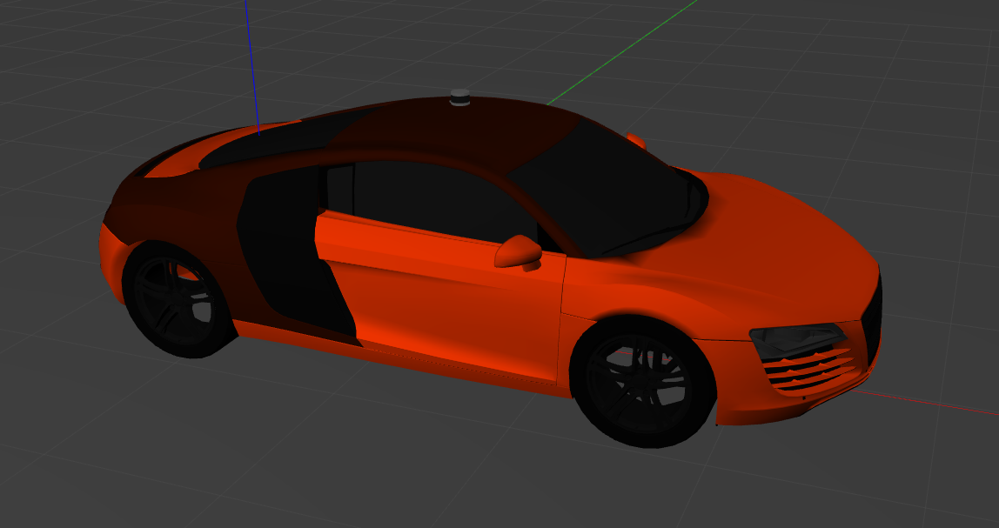

# CarSimulation


## Summary
Ackermann Car Simulation with 3D Velodyne Lidar in Gazebo Environment.



## Installation

```shell
$ mkdir ws/src -p
$ cd ws/src
$ git clone --recursive https://github.com/CihatAltiparmak/car_sim.git
$ cd ..
$ source /opt/ros/foxy/setup.bash
$ colcon build
$ source install/setup.bash
```

## How To Use

Firstly, run launch file

```shell
$ ros2 launch car_sim_gazebo world.launch.py extra_gazebo_args:="--verbose" gpu:=true
```

In another shell, you can control velocity and steering angle of the car by publishing AckermannDriveStamped ros2 message. 

**Warning: Steering angle is in radyan type, not in degree.** 

```shell
$ ros2 topic pub --once /itusct/command_cmd ackermann_msgs/msg/AckermannDriveStamped "header:
  stamp:
    sec: 0
    nanosec: 0
  frame_id: ''
drive:
  steering_angle: 0.1
  steering_angle_velocity: 0.0
  speed: 5.0
  acceleration: 0.0
  jerk: 0.0"
```


## Control By Keyboard

Run executable file in car_sim_gazebo

```shell
$ ros2 run car_sim_gazebo teleop_keyboard.py
```

After running `teleop_keyboard.py`, you can control the car with keys `w`, `a`, `s`, `d`, `x`. Inspired by [teleop_twist_keyboard](https://github.com/ros-teleop/teleop_twist_keyboard/blob/master/teleop_twist_keyboard.py) ros package.

`w` -> increases the car's speed.

`x` -> decreases the car's speed. (if speed of the car is negative, car start to go backward.)

`a` -> increases the car's steering angle

`d` -> decreases the car's steering angle

`s` -> stops the car and zeros the car's steering angle

## Useful Links

[gazebo_ros_ackermann_drive plugin](https://github.com/ros-simulation/gazebo_ros_pkgs/blob/foxy/gazebo_plugins/src/gazebo_ros_ackermann_drive.cpp)

[Bosch Future Mobility Challenge Simulator Codes](https://github.com/ECC-BFMC/Simulator/blob/main/src/plugins_pkgs/car_plugin/src/carlikerobot.cpp)

[Audibot Car Plugin](https://github.com/robustify/audibot/blob/ros2/audibot_gazebo/src/AudibotInterfacePlugin.cpp)

[SD TwizyModel Description Files](https://github.com/streetdrone-home/SD-TwizyModel/blob/master/streetdrone_model/sd_description/urdf/sd_twizy.urdf.xacro)

[SD TwizyModel Plugin](https://github.com/streetdrone-home/SD-TwizyModel/blob/master/streetdrone_model/sd_control/src/sd_control_plugin.cpp)

[yukkysaito/car_demo plugin file](https://github.com/yukkysaito/car_demo/blob/master/car_demo/plugins/PriusHybridPlugin.cc#L1149)

[Audibot Car Description File](https://github.com/robustify/audibot/tree/ros2/audibot_description)

## License

This repo is under MIT LICENSE

# CONTRIBUTORS


# TODO

- [ ] Add car control option based on acceleration and angular velocity
- [ ] Add brake system
- [ ] Provide car control options for simulation to user.
- [ ] Improve PID. Provide better PID parameters for linear velocity control and steering degree control. (Parameters are found by trial and error method.)
- [ ] Add IMU sensor
- [ ] Add GPS sensor
- [ ] Any innovative idea.

# Thanks To

[robustify/audibot](https://github.com/robustify/audibot)

[streetdrone-home/SD-TwizyModel](https://github.com/streetdrone-home/SD-TwizyModel)

[yukkysaito/car_demo](https://github.com/yukkysaito/car_demo)

[ECC-BFMC/Simulator](https://github.com/ECC-BFMC/Simulator)
